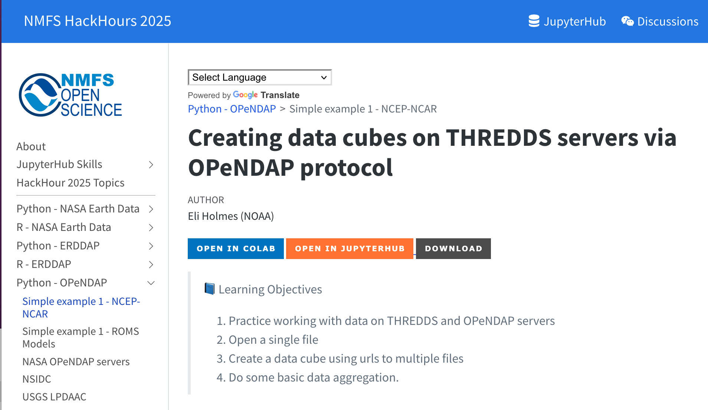
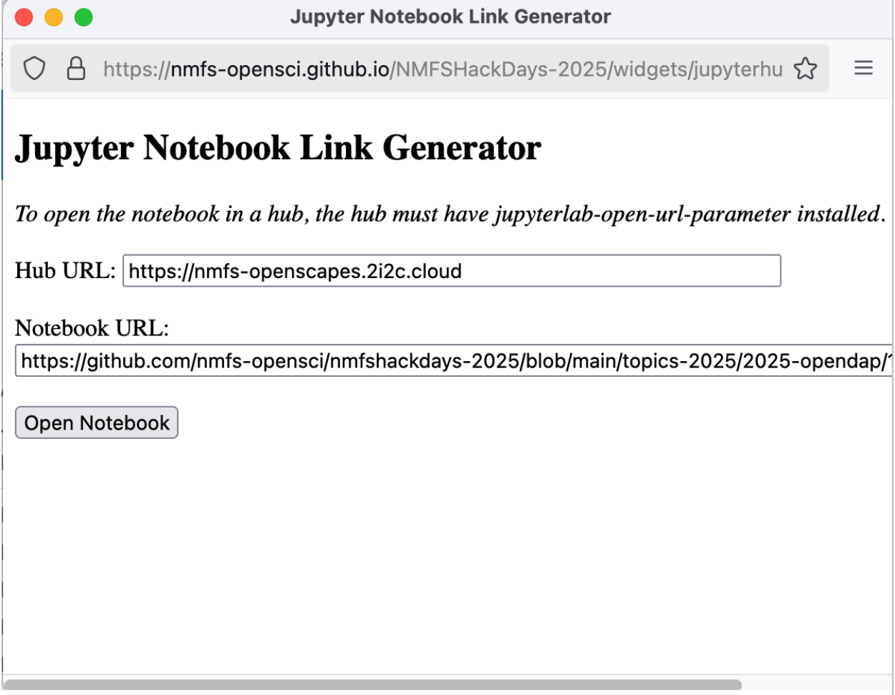

# Click to open a single notebook in a JupyterHub

This is an approach developed by Eli Holmes (NOAA Fisheries, @eeholmes).  It is a big deal for teaching workshops, as it enables someone to click a link and open a single notebook in a JupyterHub. This is preferable to other options where someone would have to use GitHub to clone a whole repository, or use nbgitpuller to clone a whole repository. This makes it easier for workshop participants (no need to navigate into subfolders) and keeps hub costs low (no cloning lots of files that won't be used).

## Working example: NMFS Hackdays

1. From <https://nmfs-opensci.github.io/NMFSHackDays-2025/topics-2025/2025-opendap/1-ncep-ncar.html>, click the orange button:



2. A popup window opens; click "Open notebook"



3. This takes you to the NMFS Openscapes Jupyter Hub landing page, and you can click to log in if you have access permission (i.e. you are a mentor or workshop participant). It will give you a base image to select.

4.The notebook will be open in your home directory! Celebrate – this is quite streamlined for new learners and will keep storage costs low!


## Hub prerequisites

The hub where you are teaching needs a module pip installed:

1. In the hub environment (by admin), `pip install jupyterlab-open-url-parameter`. 
  - [NMFS Hackdays example](https://github.com/nmfs-opensci/py-rocket-base/blob/main/environment.yml#L61)

## Create a button or link

### Simple Link

In a markdown cell in the jupyter notebook, create a link that will redirect using a raw github user content link.

Example: `[Open Notebook In Jupyter Hub](https://nmfs-openscapes.2i2c.cloud/hub/user-redirect/lab?fromURL=https://raw.githubusercontent.com/nmfs-opensci/nmfshackdays-2025/main/topics-2025/2025-opendap/1-ncep-ncar.ipynb)`

The three parts of the url are: 
    - hub: `https://nmfs-openscapes.2i2c.cloud/hub/user-redirect/lab?fromURL=`
    - repo prefix (note "raw"): `https://raw.githubusercontent.com/`
    - notebook location: `nmfs-opensci/nmfshackdays-2025/main/topics-2025/2025-opendap/1-ncep-ncar.ipynb`
   
### Button

Easy and looks nice.


In a markdown cell in the jupyter notebook, add this markdown to create a button link.
```
[][jupyter-link]

[jupyter-link]: https://nmfs-openscapes.2i2c.cloud/hub/user-redirect/lab?fromURL=https://raw.githubusercontent.com/nmfs-opensci/nmfshackdays-2025/main/topics-2025/2025-opendap/1-ncep-ncar.ipynb
```

### Colab, Jupyter Hub and Download buttons

To accomodate multiple ways of opening a notebook. Add this to top of notebook:

```
[][colab-link] [][jupyter-link] [][download-link]

[download-link]: https://nmfs-opensci.github.io/NMFSHackDays-2025/topics-2025/2025-opendap/1-ncep-ncar.ipynb
[colab-link]: https://colab.research.google.com/github/nmfs-opensci/nmfshackdays-2025/blob/main/topics-2025/2025-opendap/1-ncep-ncar.ipynb
[jupyter-link]: https://nmfs-openscapes.2i2c.cloud/hub/user-redirect/lab?fromURL=https://raw.githubusercontent.com/nmfs-opensci/nmfshackdays-2025/main/topics-2025/2025-opendap/1-ncep-ncar.ipynb
```

### Pop out widget

Eli created a pop up widget so the user can select other hubs where they want to open the notebook.  This is a bit more complicated and not needed.

1. Two files are added to the website repo in a widget directory: <https://github.com/nmfs-opensci/NMFSHackDays-2025/tree/main/widgets>
2. The `_quarto.yml` has this
```
resources:
  - widgets/jupyterhub_link_widget.html
  - widgets/widget-popout.html
```
3. The code for the button looks like this now
```
<a href="javascript:void(0);" onclick="openJupyterWidget('https://github.com/nmfs-opensci/nmfshackdays-2025/blob/main/topics-2025/2025-opendap/1-ncep-ncar.ipynb');">
    
</a>
```


